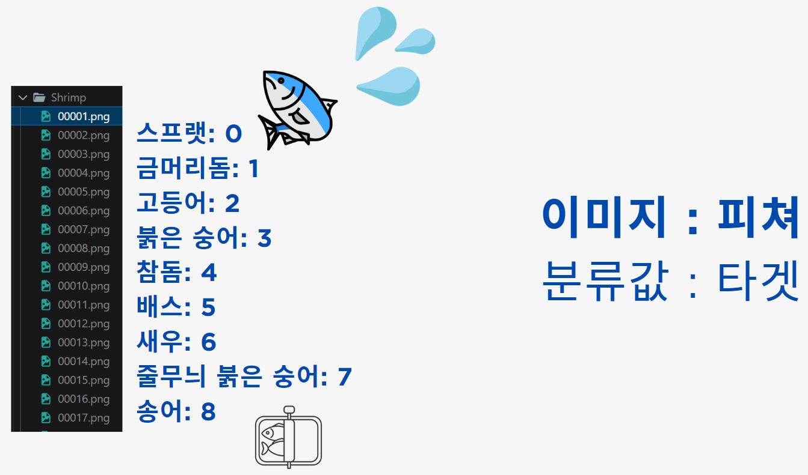
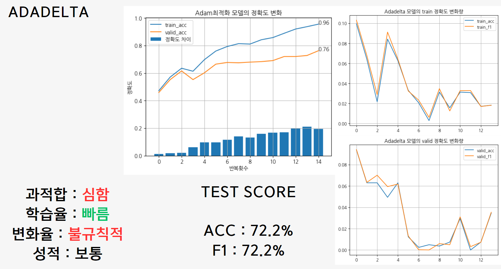
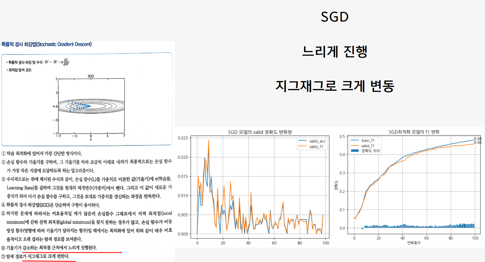
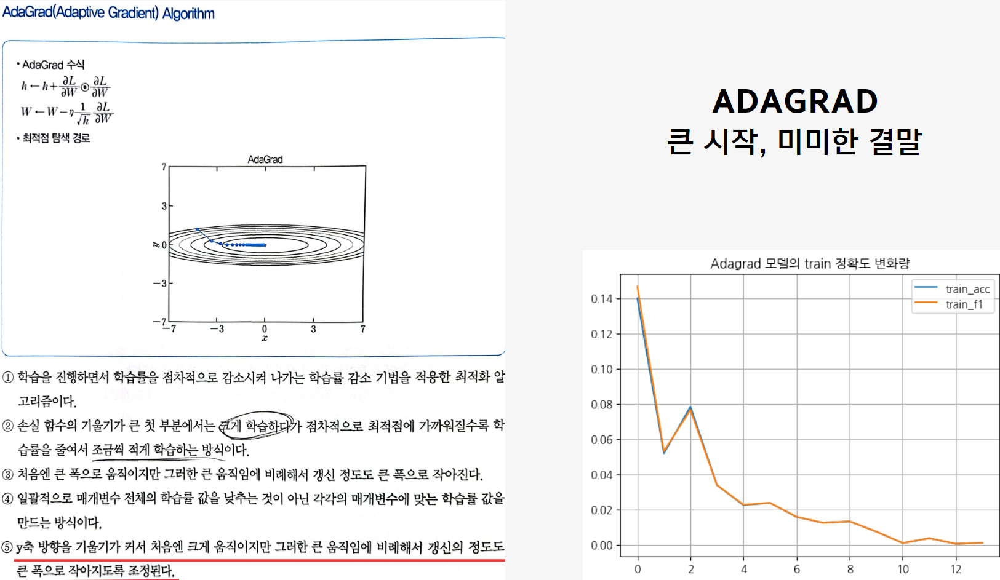
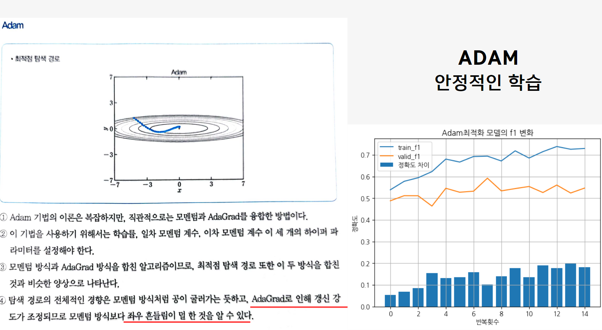
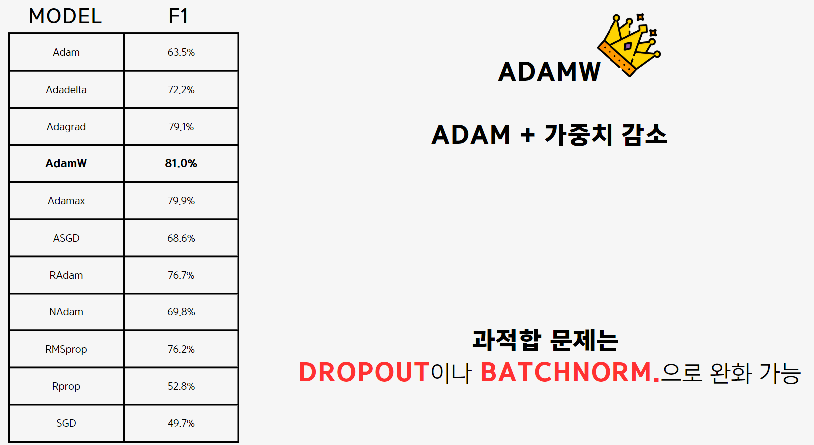

# _KDT05-Deep Learning Project_

경북대학교 KDT(Korea Digital Training) 빅데이터 전문가 양성과정 5기 : DL(Deep Learning) 3팀입니다

명노아 : [깃허브 링크](https://github.com/noah2397)  
이윤서 : [깃허브 링크](https://github.com/voo0o08)  
김동현 : [깃허브 링크](https://github.com/DongHyunKKK)  
이현길 : [깃허브 링크](https://github.com/Schubert3275)


<hr/>

#### 개발환경

| 패키지 이름 | 버전   |
| ----------- | ------ |
| Python      | 3.8.18 |
| torch       | 2.2.0  |
| pandas      | 2.0.3  |
| matplotlib  | 3.7.2  |
| sns         | 0.12.2 |
| np          | 1.24.3 |
| sklearn     | 1.3.0  |

<hr/>

### KDT(Korea Digital Training)-DL(Deep learning)

<hr/>

#### 사용한 데이터 사이트(수정 전)

1. [Kaggle](https://www.kaggle.com/datasets/crowww/a-large-scale-fish-dataset)

<hr/>

###### 주제 : 딥러닝의 딥러닝

- 목차

* 1. 역할 분담
* 2. 주제 선정 배경
* 3. 데이터 선정 배경
* 4. 소주제 개요
* 5. 옵티마이저와 성능의 상관관계(명노아)
* 6. 퍼셉트론과 성능의 상관관계(이윤서)
* 7. 은닉층과 성능의 상관관계(김동현)
* 8. 최종 모델 구현(이현길)
* 9. 예측 서비스 구현
* 10. 출처
  </hr>

###### 역할 분담

|          역할 | 김동현 | 이윤서 | 명노아 | 이현길 |
| ------------: | ------ | ------ | ------ | ------ |
|      주제선정 | ✅     |        |        | ✅     |
| 데이터셋 선정 |        |        | ✅     | ✅     |
| 이미지 전처리 |        | ✅     | ✅     |        |
|        Readme | ✅     | ✅     | ✅     | ✅     |
|   서비스 구현 | ✅     | ✅     |        | ✅     |

###### 개발 공통 환경

```
- BATCH_SIZE = 50
- LEARNING_RATE = DEFAULT
- 최적화 함수 → ADAM
- 활성화 함수 적용 시점 → 각 레이어마다
- 가중치 초기화 → HE
- TRAIN : VALIDATION : TEST = 90 : 9 : 1
- 데이터로더    SHUFFLE = TRUE
               DROP_LAST = TRUE
```

### 소주제 개요(개인 항목)

<details>
  <summary>
    명노아(옵티마이저 최적화 분석)
  </summary>

### 1. 주제 선정 배경

- 과적합 방지
- 계산 효율성
- 해석성

-> 해당 요소를 모델에 미치는 요소로 알아보기 위해 주제 선정  
-> 모델에 영향을 끼치는(옵티마이저, 퍼셉트론, 은닉층) 요소로 성능 탐색

### 2. 데이터 선정 배경

- 성능이 낮게 나오는 데이터 선정
- MNIST_NUMBER는 성능이 높게 나오므로, Kaggle에서 제공하는 Scaled_FISH 데이터 사용

### 3. 데이터 선정



- 총 9종류의 물고기 폴더가 있고, 각 폴더당 1000개의 이미지 데이터가 있음
- 각 이미지를 100X150, 49X59로 resize하여, feature의 개수를 줄임
- np.concatenate로 이미지 데이터를 계속해서 stack함
- npy 파일로 저장하기에는 용량이 커서, pkl(피클) 파일로 저장

### 4. 데이터 분석 파이프라인

    ```
    1. feature는 float타입으로, target은 long타입으로 변환
    2. 데이터셋 클래스 생성
    3. 데이터셋 생성
    4. 모델 클래스 생성
    5. 모델 생성
    6. 옵티마이저, 손실함수 정의
    7. 데이터로더 생성
    8. 스케줄러 생성&학습
    9. 학습 진행
    10. 평가
    ```

### 5. 진행한 모델 및 결과

#### 사용한 모델

| 모델 이름  | 모델 설명                                                                                                                                                      |
| ---------- | -------------------------------------------------------------------------------------------------------------------------------------------------------------- |
| ADAM       | Adam은 경사 하강 최적화 알고리즘 중 하나로, 목적 함수에 대한 일차 및 이차 모멘트 추정치를 저장하여 각 매개 변수에 대한 각각의 학습 속도를 동적으로 조절합니다. |
| ADADELTA   | Adadelta는 AdaGrad의 변형으로, 학습률을 조정하는 데 지난 그래디언트의 제곱을 누적하는 대신 일정한 시간 간격 내 제한된 메모리만 사용하여 학습률을 조정합니다.   |
| ADAGRAD    | Adagrad는 각 매개 변수에 대해 학습률을 조정하는 경사 하강 최적화 알고리즘으로, 이전의 그래디언트 업데이트를 기억하여 학습률을 조절합니다.                      |
| ADAMW      | AdamW는 Adam의 변형으로, 가중치 감쇠를 추가하여 가중치 업데이트의 안정성을 향상시키는 방법입니다.                                                              |
| SPARSEADAM | SparseAdam은 Adam 최적화 알고리즘의 희소 버전으로, 희소 그래디언트 및 희소 가중치에 대해 최적화됩니다.                                                         |
| ASGD       | 평균 확률적 경사 하강(ASGD)은 일정 시간 동안의 그래디언트 업데이트의 평균을 사용하여 경사 하강 최적화를 수행하는 방법입니다.                                   |
| RADAM      | Rectified Adam(RAdam)은 Adam 최적화 알고리즘의 변형으로, 효과적인 학습률 조정을 통해 안정적인 학습을 돕는 방법입니다.                                          |
| NADAM      | Nesterov Adam(Nadam)은 Adam 최적화 알고리즘의 변형으로, 네스테로프 모멘텀 최적화를 Adam에 통합하는 방법입니다.                                                 |
| RMSPROP    | RMSProp은 AdaGrad의 변형으로, 지난 제곱된 그래디언트의 지수 가중 이동 평균을 사용하여 학습률을 조정하는 방법입니다.                                            |
| RPROP      | Resilient Backpropagation(Rprop)은 그래디언트 부호에 따라 매개 변수 업데이트를 수행하여 경사 하강 최적화를 수행하는 방법입니다.                                |
| GSD        | Gradient Sparsification and Densification(GSD)은 그래디언트의 희소성을 관리하여 효율적인 학습을 도와주는 방법입니다.                                           |

#### 평가 기준

- 동일 분류 개수의 데이터셋이므로, f1을 옵티마이저 측정 기준으로 설정
- 아래 형식과 같이 train 정확도와 valid 정확도,
- 옵티마이저의 train 정확도 변화량
- 옵티마이저의 valid 정확도 변화량으로 옵티마이저 측정
  

### 6. 결과 및 분석

#### SGD(Stocahstic Gradient Descent)

- 학습 속도가 느리게 진행
- 지그재그로 크게 변동



#### ADAGRAD(AdaGrad)

- 크게 학습하다가 점차적으로 최적점에 가까워짐
- 갱신의 정도가 큰 폭으로 작아지도록 조정



#### ADAM(Adaptive Moment Estimation)

- 모멘텀과 AdaGrad를 융합한 방법
- 모멘텀 방식보다 좌우 흔들림이 덜 하다
  

### 7. 최종결론



 </details>

</hr>

<details>
  <summary>
    이윤서(퍼셉트론 수와 성능의 관계)
  </summary>

- 실험 1 : 히든 레이어 없는 상태로 퍼셉트론 수 변경
    
    <div class="aside">
    
    ✏️ perceptron_num → 100
    ```
    Linear(in_features=2655, out_features=perceptron_num, bias=True)
    ReLU()
    Linear(in_features=perceptron_num, out_features=9, bias=True)
    ```
    </div>
    
    **결과**
    
    심하게 작은 값들은 n회 수행에도 score가 낮았지만, 일정 퍼셉트론 값 이상부터는 70 정도로 결과가 나오는 것을 확인할 수 있었다.
    
    
    
- 실험 2 : 히든 레이어 2개인 상태로 퍼셉트론 수 변경1
    
    <div class="aside">
    ✏️ perceptron_num → 100
      
    ```
    Linear(in_features=2655, out_features=perceptron_num, bias=True)
    ReLU()
    Linear(in_features=perceptron_num, out_features=perceptron_num, bias=True)
    ReLU()
    Linear(in_features=perceptron_num, out_features=perceptron_num, bias=True)
    ReLU()
    Linear(in_features=perceptron_num, out_features=9, bias=True)
    ```
    
    </div>
    
    **결과**
    
    마찬가지로 값이 심하게 크거나 작지 않은 이상 값이 70 정도임을 알 수 있었고, 1번 실험은 전체 수행 시간이 10분인 반면 레이어가 생기고 퍼셉트론 수를 높이니 계산 비용이 증가하여 1시간 이상 실행되었다. 또한 들인 시간에 비해 score가 높아지지 않았다. 
    
    
    


    
- 실험 3 : 히든 레이어 2개인 상태로 퍼셉트론 수 변경2
    
    <aside>
    ✏️ perceptron_num → n1, n2, n3…
      
    ```
    Linear(in_features=2655, out_features=n1, bias=True)
    ReLU()
    Linear(in_features=n1, out_features=n2, bias=True)
    ReLU()
    Linear(in_features=n2, out_features=n3, bias=True)
    ReLU()
    Linear(in_features=n3, out_features=9, bias=True)
    ```
    
    </aside>
    
    **결과**
    
    2번 실험과 달리 레이어수를 출력층에 가까울 수록 작아지게 설정하였다. 수행 시간 15분으로 줄었고, 결과에는 큰 차이가 없음을 알 수 있었다.
    
    


**결론**

퍼셉트론은 경우의 수가 너무 많은 하이퍼파라미터로 ‘특정 값을 찾겠다!’ 보다는 ‘이 정도 값은 제외해야겠다’ 정도로 사용하고 다른 하이퍼파라미터를 조정하는 것이 효과적이다.
</details>

</hr>

<details>
  <summary>
    김동현
  </summary>

</details>

</hr>

<details>
  <summary>
    이현길
  </summary>

</details>
<hr/>
